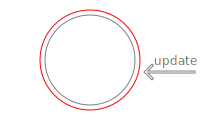

# Wrap mutant. Core

[](https://www.npmjs.com/package/@wrap-mutant/core)
[](https://www.npmjs.com/package/@wrap-mutant/core)
[](https://github.com/kai3341/wrap-mutant/tree/main/packages/core)
[](http://github.com/kai3341/wrap-mutant/issues)
[](http://github.com/kai3341/wrap-mutant)
[](https://github.com/kai3341/wrap-mutant/blob/main/LICENSE)
[](https://t.me/wrap_mutant/2)

Object mutation is easy and extremelly fast. But such libraries like react make us to rebuild objects on every their change. It's not a problem on simple and small objects. When your object is a big array, your application become slow. When you are trying to handle complicated deeply nested object, it becomes a brain cancer.

Solution is in wrapping that big or complex objects into [Proxy](https://developer.mozilla.org/en-US/docs/Web/JavaScript/Reference/Global_Objects/Proxy) object.

## Examples

reactflow example [[demo](https://kai3341.github.io/d73bce02-46a1-4e59-895a-4863c2fc48f0/) | [repo](https://github.com/kai3341/d73bce02-46a1-4e59-895a-4863c2fc48f0)]

- [/src/pages/projects/projects.tsx](https://github.com/kai3341/d73bce02-46a1-4e59-895a-4863c2fc48f0/blob/master/src/pages/projects/projects.tsx)
- [/src/lib/statemgr.ts](https://github.com/kai3341/d73bce02-46a1-4e59-895a-4863c2fc48f0/blob/master/src/lib/statemgr.ts)

[pravosleva](https://github.com/pravosleva)'s substring-highlight-sample [[demo](https://kai3341.github.io/substring-highlight-sample/) | [repo](https://github.com/kai3341/substring-highlight-sample)]

- [/src/pages/uremont/reviews/kai3341-sample/Sample.tsx](https://github.com/kai3341/substring-highlight-sample/blob/master/src/pages/uremont/reviews/kai3341-sample/Sample.tsx)

---

# Main idea explaination on API V1

This API is naive and very easy to explain the root idea, but I see no reason to use it on the production.

```javascript
import { wrap, rewrap, unwrap } from "@wrap-mutant/core";
```

## wrap

Actually `wrap` creates `new Proxy()` object which is `wrap`ping the original object. Also it creates hidden `Symbol()` field containing the original object.

**API Reference**:

- **Required** target: `any extends Object`. It may be an `Array` or its subclass, any kind of `Object`, any `function`, any `class` constructor or instance

- **Optional** options `Object`, passed directly into [Proxy](https://developer.mozilla.org/en-US/docs/Web/JavaScript/Reference/Global_Objects/Proxy) constructor named [Proxy Handler](https://developer.mozilla.org/en-US/docs/Web/JavaScript/Reference/Global_Objects/Proxy/Proxy#handler_functions). **Default**: `{}`

## unwrap

So it's obvious the `unwrap` just reads hidden `Symbol()` property of wrapped object and returns its value. Keep in mind `unwrap` is also works with API V2.

**API Reference**:

- **Required** target: `any extends Object`, which have to be already `wrap`ped via [API V1 wrap](#wrap) or [API V2 wrapCached](#wrapCached)

## rewrap

And `rewrap` is synonym of `wrap(unwrap(target))` (but actually not). I've put it into single function because of performance reason.

**API Reference**:

- **Required** target: `any extends Object`, which have to be already `wrap`ped via [API V1 wrap](#wrap) **only**



---

# API V2

And I hope just this API you will use in you production. Usage is almost the same, but it works in a bit different way. Instead of creating `new Proxy()` object on each mutation we can pre-create batch [Proxy](https://developer.mozilla.org/en-US/docs/Web/JavaScript/Reference/Global_Objects/Proxy) objects and then rotate tham via roundrobin algothythm. It means the cost of the each reference update becomes a zero.

```javascript
import { wrapCached, toggleCached, unwrap } from "@wrap-mutant/core";
```

## wrapCached

The **wrapCached** signature is very similar to [API V1 wrap](#wrap).

**API Reference**:

- **Required** target: `any extends Object`. It may be an `Array` or its subclass, any kind of `Object`, any `function`, any `class` constructor or instance

- **Optional** count: `Number` meaning how many [Proxy](https://developer.mozilla.org/en-US/docs/Web/JavaScript/Reference/Global_Objects/Proxy) objects will be pre-created. **Default**: `3`. There is no point to make it less then `2`, but you may pass more if you need

- **Optional** options `Object`, passed directly into [Proxy](https://developer.mozilla.org/en-US/docs/Web/JavaScript/Reference/Global_Objects/Proxy) constructor named [Proxy Handler](https://developer.mozilla.org/en-US/docs/Web/JavaScript/Reference/Global_Objects/Proxy/Proxy#handler_functions). **Default**: `{}`

## toggleCached

And `toggleCached` usage is the same as `rewrap`, but it returns next pre-created [Proxy](https://developer.mozilla.org/en-US/docs/Web/JavaScript/Reference/Global_Objects/Proxy) object.

**API Reference**:

- **Required** target: `any extends Object`, which have to be already `wrap`ped via [API V2 wrapCached](#wrapCached) **only**



---

# Additional API

Some API is universal. Normally you don't need in it, but this door should exist

## unwrap

```javascript
import { unwrap } from "@wrap-mutant/core";
```

So it's obvious the `unwrap` just reads hidden `Symbol()` property of wrapped object and returns its value. Keep in mind `unwrap` is also works with API V2. Normally you don't need to use this API

**API Reference**:

- **Required** target: `any extends Object`, which have to be already `wrap`ped via [API V1 wrap](#wrap) or [API V2 wrapCached](#wrapCached)

## clean

```javascript
import { clean } from "@wrap-mutant/core";
```

Cleanup the target object from this library additional hidden `Symbol()` fields. Works both with API V1 and API V2. Before `clean`ing it wold be good idea to `unwrap` the target object (you have to do it yourself). Normally you don't need to use this API

**API Reference**:

- **Required** target: `any extends Object`, which have to be already `unwrap`ped

---

# Any questions?

Don't be afraid to open [this library source code](https://github.com/kai3341/wrap-mutant/tree/main/packages/core) -- it's really small. Also we have [Telegram Community](https://t.me/wrap_mutant/2)
