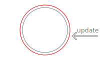
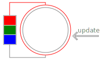

# Wrap mutant. Core

Object mutation is easy and extremelly fast. But such libraries like react make us to rebuild objects on every their change. It's not a problem on simple and small objects. When your object is a big array, your application become slow. When you are trying to handle complicated deeply nested object, it becomes a brain cancer.

Solution is in wrapping that big or complex objects into [Proxy](https://developer.mozilla.org/en-US/docs/Web/JavaScript/Reference/Global_Objects/Proxy) object.

> // TODO: create an example application aimed to explain how to use this library and benchmarking

---

# Main idea explaination on API V1

This API is naive and very easy to explain the root idea, but I see no reason to use it on the production.

```javascript
import { wrap, unwrap, rewrap } from "@wrap-mutant/core";
```

Actually `wrap` creates `new Proxy()` object which is `wrap`ping the original object. Also it creates hidden `Symbol()` field containing the original object.

So it's obvious the `unwrap` just reads hidden `Symbol()` property of wrapped object and returns its value. Keep in mind `unwrap` is also works with API V2.

And `rewrap` is synonym of `wrap(unwrap(target))`. I've put it into single function because of performance reason.



---

# API V2

And I hope just this API you will use in you production. Usage is almost the same, but it works in a bit different way. Instead of creating `new Proxy()` object on each mutation we can pre-create batch [Proxy](https://developer.mozilla.org/en-US/docs/Web/JavaScript/Reference/Global_Objects/Proxy) objects and then rotate tham via roundrobin algothythm. It means the cost of the each reference update becomes a zero.

```javascript
import { wrapCached, toggleCached, unwrap } from "@wrap-mutant/core";
```

Difference between `wrap` and `wrapCached` usage is the `wrapCached` accepts additional optional argument `count` meaning how many [Proxy](https://developer.mozilla.org/en-US/docs/Web/JavaScript/Reference/Global_Objects/Proxy) objects will be pre-created. By default `count=3`. There is no point to make it less then `2`, but you may pass more if you need.

And `toggleCached` usage is the same as `rewrap`, but it returns next pre-created [Proxy](https://developer.mozilla.org/en-US/docs/Web/JavaScript/Reference/Global_Objects/Proxy) object.



---

# Additional API

Some API is universal. Normally you don't need in it, but this door should exist

## unwrap

Allows to extract wrapped object. As you seen earlier works both with API V1 and V2. Normally you don't need to use this API

```javascript
import { unwrap } from "@wrap-mutant/core";
```

## clean

Cleanup the target object from this library additional hidden `Symbol()` fields. Works both with API V1 and API V2. Before `clean`ing it wold be good idea to `unwrap` the target object (you have to do it yourself). Normally you don't need to use this API

```javascript
import { clean } from "@wrap-mutant/core";
```

---

# Any questions?

Don't be afraid to open this library source code -- it's really small (54 lines)
